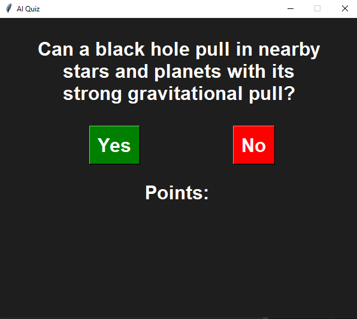

# AI Quiz Game 🎮🧠


An interactive **AI-powered quiz game** built with Python and Tkinter. The game generates **yes/no questions about astronomy and astrophysics** using OpenAI's GPT-3.5-turbo model. Players earn points for correct answers and can restart the game after completing 5 questions.

---

## 📸 Screenshot



---

## 🛠 Features

* Generates engaging **yes/no questions** about astronomy/astrophysics.
* Tracks your **score** out of 5.
* Gives **feedback** based on your performance:

  * 5/5: "You are an expert!"
  * 3–4/5: "You know your stuff"
  * 1–2/5: "Decent"
  * 0/5: "Bad"
* Option to **restart** the game after finishing.
* Simple and clean **Tkinter GUI** with Yes/No buttons.

---

## 🚀 How to Run

1. Clone the repository:

```bash
git clone https://github.com/yourusername/ai-quiz-game.git
cd ai-quiz-game
```

2. Install dependencies:

```bash
pip install openai
```

3. Add your **OpenAI API key** in `ai_quiz_game.py`:

```python
client = openai.OpenAI(api_key = "YOUR_API_KEY_HERE")
```

4. Run the game:

```bash
python ai_quiz_game.py
```

---

## 📝 Usage

* Click **Yes** or **No** to answer the question.
* Your points are updated after each question.
* After 5 questions, see your performance feedback and **restart** if you want to play again.

---

## 📦 File Structure

```text
ai-quiz-game/
├── ai_quiz_game.py   # Main game script
├── README.md         # Project description
└── screenshot.png    # Example screenshot
```

---

## ⚡ Future Improvements

* Add multiple categories of questions.
* Include difficulty levels.
* Save **high scores** across sessions.
* Add more interactive GUI elements and animations.

---

## 💻 Technologies

* Python 3.x
* Tkinter for GUI
* OpenAI GPT-3.5-turbo for AI-generated questions

---

## 📧 Contact

Created by **[Jimoulis31]** – feel free to open issues or contribute!
